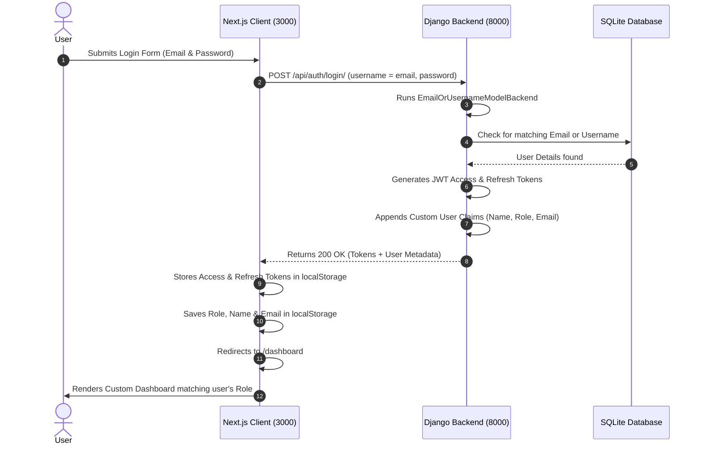

# Next.js Frontend to Django Backend Integration Guide

This guide details the integration of the decoupled architecture between our **Next.js Frontend** (running on port 3000) and our **Django REST Framework Backend** (running on port 8000).

---

## 🛠️ Architecture Overview

The system operates as a state-of-the-art **Decoupled Client-Server API model**:
1. **Next.js Client (Port 3000)**: Serves the User Interface, manages client state, secures routing guards via React Hooks, and makes asynchronous fetch requests.
2. **Django Server (Port 8000)**: Serves API endpoints, implements business logic, handles database operations, and secures endpoints using **JSON Web Tokens (JWT)**.



---

## 🗝️ Key Features Implemented

### 1. Unified Authentication Backend (`backends.py`)
Standard Django authenticates only using the `username` field. Since our signup/login forms collect `email`, we implemented `EmailOrUsernameModelBackend` in [backends.py](file:///c:/Users/himan/OneDrive/Desktop/IMS-institute-management-system-/backend/apps/accounts/backends.py).
* It dynamically intercepts the credentials.
* It checks case-insensitively for a matching **Email** first.
* If not found, it falls back to standard **Username** authentication.
* Fully compatible with standard SimpleJWT libraries.

### 2. Rich Response Serializer (`views.py`)
SimpleJWT returns only the encrypted access and refresh tokens. We extended the `TokenObtainPairSerializer` in [views.py](file:///c:/Users/himan/OneDrive/Desktop/IMS-institute-management-system-/backend/apps/accounts/views.py) to automatically decode and return user profile details in the response body.
* Custom JWT payload claims include: `role`, `email`, `username`, `first_name`, `last_name`.
* Direct JSON response data contains the same properties.
* Allows instantaneous client-side rendering without redundant profile fetches.

### 3. Asynchronous User Registration (`views.py` & `urls.py`)
Added a secure `RegisterView` endpoint at `http://localhost:8000/api/auth/register/` to support creating accounts with dynamic roles (Students or Teachers).
* Checks for email uniqueness.
* Automatically derives unique fallback usernames.
* Safely salts and hashes passwords.

### 4. Client-side Routing Guard & Dynamic Dashboard (`dashboard/page.tsx`)
Created a gorgeous Dashboard at [page.tsx](file:///c:/Users/himan/OneDrive/Desktop/IMS-institute-management-system-/frontend/app/dashboard/page.tsx).
* Secured with a client-side `useEffect` mount check that locks the route.
* Adapts its sidebars, quick actions, statistics, and theme elements based on whether the logged-in user is a **Super Admin**, a **Teacher**, or a **Student**.

---

## 🚀 How to Run the App

Follow these simple steps in separate terminal terminals to run your integrated IMS project:

### Step 1: Start the Django Backend
Open a terminal in the `backend` directory, activate the environment, and start the server:
```powershell
# Navigate to backend directory
cd backend

# Activate Virtual Environment (Windows PowerShell)
.venv\Scripts\Activate.ps1

# Run system check (Optional)
python manage.py check

# Start Development Server
python manage.py runserver
```
> [!NOTE]
> The Django backend will run on **`http://127.0.0.1:8000/`**.

### Step 2: Start the Next.js Frontend
Open another terminal in the `frontend` directory, install packages, and start the server:
```powershell
# Navigate to frontend directory
cd frontend

# Install any dependencies
npm install

# Start Next.js server
npm run dev
```
> [!NOTE]
> The Next.js frontend will run on **`http://localhost:3000/`**.

---

## 🧪 Testing Credentials

You can use the following default admin credentials to test the authentication flow:

* **Email Address**: `admin@example.com`
* **Username**: `admin`
* **Password**: `admin123`
* **User Role**: `super_admin`

### Or register a new account:
1. Click the **"Sign Up"** link on the login page.
2. Enter your details and select your role (**Student** or **Teacher**).
3. Click **"Create Account"**. Upon success, it will automatically redirect you to the login form after 2 seconds.
4. Enter the new credentials and log in to explore your customized, role-adaptive portal!
